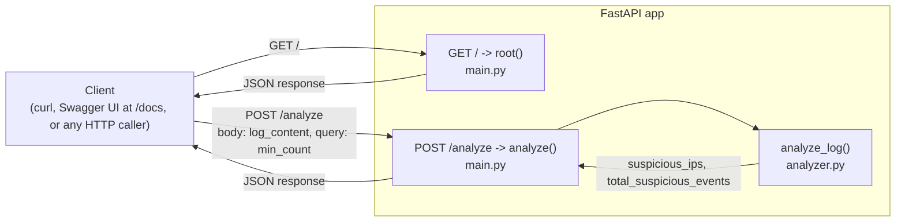
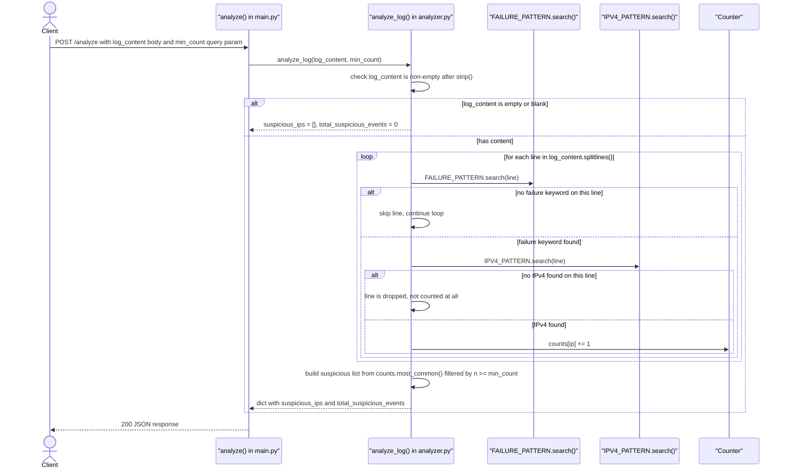
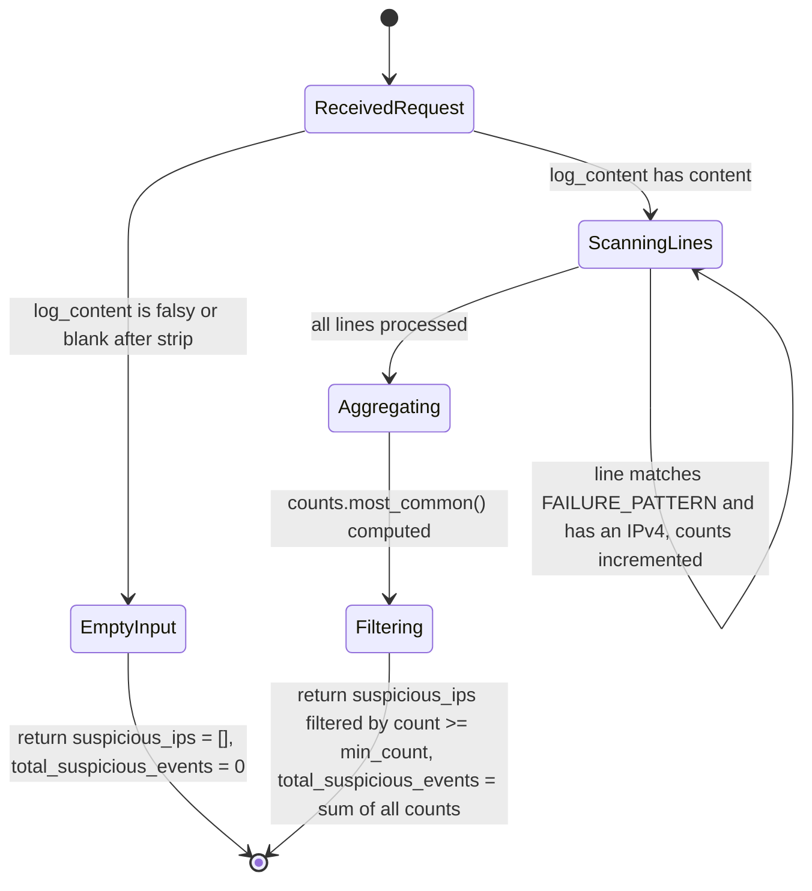
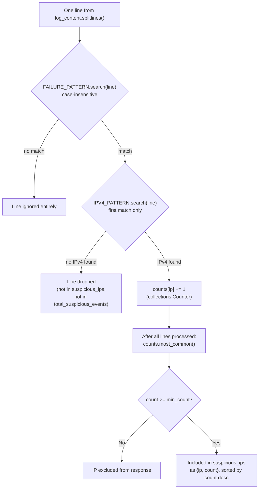

# AI Log Analyzer (Log Brute-Force Analyzer)

A single-purpose FastAPI microservice that accepts raw log text over HTTP and
returns suspicious IP addresses based on failed-authentication patterns.
Despite the repository name, there is no AI/ML component anywhere in the
code (confirmed by grepping every `.py` file for `openai`, `anthropic`,
`torch`, `sklearn`, `model`, `llm`, etc. — zero hits): detection is a plain,
deterministic pair of regular expressions in `analyzer.py`. Real tech stack,
read directly from source: **FastAPI** (`>=0.109.0`) on **Uvicorn**
(`>=0.27.0`), pure Python standard library (`re`, `collections.Counter`) for
the analysis logic, no database, no external API calls, and no frontend —
this is a headless, three-file API service meant to be deployed to Vercel's
zero-config Python runtime via `app.py`.

## 1. Setup

```bash
git clone https://github.com/omdesale777/ai-log-analyzer.git
cd ai-log-analyzer
python -m venv .venv
source .venv/bin/activate        # Windows: .venv\Scripts\activate
pip install -r requirements.txt
uvicorn main:app --reload
```

- Swagger UI: `http://127.0.0.1:8000/docs`
- Root: `http://127.0.0.1:8000/`
- Analyze: `POST http://127.0.0.1:8000/analyze`

`.python-version` pins `3.12` (used by pyenv-style tooling to select the
interpreter), while `requirements.txt` only floors versions
(`fastapi>=0.109.0`, `uvicorn[standard]>=0.27.0`) with no upper bound and no
lockfile.

**No environment variables are read anywhere in this codebase** — confirmed
by `grep -rn "os.environ\|os.getenv\|dotenv" *.py`, which returns nothing.
There is nothing to configure via `.env`.

## 2. Scripts

There is no `package.json` in this repo (it's pure Python), so there are no
npm scripts. The only run commands that exist are the ones in Setup above:

- `uvicorn main:app --reload` — run the dev server locally.
- `uvicorn main:app` (no `--reload`) — how Vercel's Python runtime effectively
  invokes `app.py`, which simply does `from main import app` so the platform
  can discover the FastAPI instance with zero extra config.

There is no `vercel.json` in the repo either; the "Vercel-ready" claim in
the original README relies entirely on Vercel's zero-config Python
detection (an `app.py` at the repo root exporting `app`), not on any
committed deployment config.

## 3. Architecture



There is no database, no object storage, and no third-party or AI API in
this diagram because none exist in the code — `analyze_log()` in
`analyzer.py` does everything in-process with two compiled regexes and a
`collections.Counter`. `app.py` is not a separate runtime component; it only
re-exports the same `app` object that `main.py` defines, for Vercel's
benefit.

## 4. Request/logic flow — POST /analyze

Traced through the real functions: `analyze()` in `main.py` calls
`analyze_log()` in `analyzer.py`, which loops over lines and applies
`FAILURE_PATTERN` then `IPV4_PATTERN`.



Two behaviors worth calling out because they are easy to misread from the
field names alone: only the *first* IPv4 match per line is used
(`IPV4_PATTERN.search`, not `.findall`), and a line that matches
`FAILURE_PATTERN` but contains no IPv4 address is dropped completely — it
does not appear in `suspicious_ips` and it is not counted in
`total_suspicious_events` either, since that field is `sum(counts.values())`
and `counts` is only ever incremented when both patterns matched the same
line.

## 5. Request-handling state machine

This service has no frontend, so there is no UI state machine to diagram —
`main.py` and `analyzer.py` are the entire application. The closest real
analog is the set of branches `analyze_log()` actually takes for a single
request, keyed on the real variable/field names in the code
(`log_content`, `counts`, `min_count`).



## 6. Per-line detection composition

How a single log line becomes (or fails to become) one entry in
`suspicious_ips`, which is the actual repo-specific logic worth visualizing
on its own since it's the whole product.



## 7. Project structure

The existing README's "Project Structure" section shows everything nested
under a `log_analyzer/` folder and tells the reader to `cd log_analyzer` —
that folder does not exist. All files sit directly at the repository root.

```
ai-log-analyzer/
├── main.py            # FastAPI app instance, GET / and POST /analyze routes
├── analyzer.py         # IPV4_PATTERN, FAILURE_PATTERN, analyze_log() — all detection logic
├── app.py              # Vercel entrypoint: `from main import app`, nothing else
├── requirements.txt    # fastapi>=0.109.0, uvicorn[standard]>=0.27.0 — no upper bounds, no lockfile
├── .python-version     # "3.12" — pyenv-style interpreter pin
├── .gitignore
└── README.md
```

## 8. Configuration / key constants

Everything the service does is governed by two module-level constants in
`analyzer.py` and the metadata literals in `main.py`. There are no other
config files, feature flags, or env-driven settings.

| Constant | File | Value |
|---|---|---|
| `IPV4_PATTERN` | `analyzer.py` | Matches a valid dotted-quad IPv4 address with octets 0–255: `` \b(?:(?:25[0-5]\|2[0-4][0-9]\|[01]?[0-9][0-9]?)\.){3}(?:25[0-5]\|2[0-4][0-9]\|[01]?[0-9][0-9]?)\b `` |
| `FAILURE_PATTERN` | `analyzer.py` | Case-insensitive match on any of: `failed`, `failure`, `invalid`, `authentication failed`, `401`, `403`, `invalid password`, `invalid user`, `access denied`, `unauthorized`, `bad password`, `wrong password`, `login failed`, `auth failed` |
| `min_count` default | `main.py`, `analyzer.py` | `1` — every IP with at least one qualifying line is returned unless overridden via the `?min_count=` query param |
| FastAPI `title` | `main.py` | `"Log Brute-Force Analyzer"` |
| FastAPI `version` | `main.py` | `"1.0.0"` |

## 9. API reference

| Method | Path | Body / Query | Implemented in | Notes |
|---|---|---|---|---|
| GET | `/` | none | `main.py` `root()` | Returns `{"service": ..., "docs": "/docs", "analyze": "POST /analyze"}` |
| POST | `/analyze` | Body: `{"log_content": "<raw text>"}` (required). Query: `min_count` (int, default `1`) | `main.py` `analyze()` → `analyzer.py` `analyze_log()` | Returns `{"suspicious_ips": [{"ip": ..., "count": ...}, ...], "total_suspicious_events": <int>}` |
| GET | `/docs` | none | FastAPI default, not custom code | Swagger UI |
| GET | `/redoc` | none | FastAPI default, not custom code | ReDoc UI — not mentioned in the existing README's route table but present on any FastAPI app that hasn't disabled it |
| GET | `/openapi.json` | none | FastAPI default, not custom code | Raw OpenAPI schema |

## 10. Troubleshooting

There is no custom error handling anywhere in this codebase — confirmed by
`grep -rn "except\|HTTPException\|raise " *.py`, which returns nothing.
Every error a caller sees comes from FastAPI/Pydantic's own request
validation, not from application code:

- **`422 Unprocessable Entity` on `POST /analyze`** — happens if the request
  body doesn't include `log_content` at all, or if `min_count` is passed as
  something that can't be coerced to an `int` (e.g.
  `?min_count=abc`). `Body(..., embed=True)` in `main.py` requires the JSON
  body to be shaped as `{"log_content": "..."}`, not a bare string.
- **Empty result with no error** — sending `log_content: ""` or
  whitespace-only text is not an error condition. `analyze_log()` checks
  `if not log_content or not log_content.strip()` and returns
  `{"suspicious_ips": [], "total_suspicious_events": 0}` directly. If you
  expect an error here, note that the code intentionally treats this as a
  valid, empty result.
- **A line you know is suspicious never shows up** — two silent-drop cases
  to check: (1) the line doesn't contain any of the exact keywords in
  `FAILURE_PATTERN` (it's a fixed list, not configurable), or (2) the line
  matches `FAILURE_PATTERN` but has no IPv4 address in it at all — such
  lines are dropped entirely rather than counted under some other key.
- **`total_suspicious_events` is lower than your own count of "suspicious"
  lines** — see the previous point; this field only counts lines that
  matched *both* regexes, not every line that matched `FAILURE_PATTERN`.
- **Request works locally but fails on Vercel with a large log file** —
  the original README attributes this to Vercel's free-tier request body
  cap (~4.5 MB) and execution timeout (10s); there is no size-limiting or
  chunking code in this repo to work around it.

## 11. Status notes

Discrepancies between the existing `README.md` and the actual code, found
by reading the three Python files directly rather than trusting the
documentation:

1. **The repo is named "AI Log Analyzer" but contains no AI or ML code at
   all.** A full-file grep for `openai`, `anthropic`, `torch`, `sklearn`,
   `tensorflow`, `model`, `llm`, and `nlp` across every `.py` file returns
   zero matches. Detection is two hardcoded, deterministic regular
   expressions (`IPV4_PATTERN`, `FAILURE_PATTERN`) and a `Counter` — no
   model inference, no embeddings, no external AI API calls of any kind.
2. **The README's "Project Structure" and "Local Setup" sections describe a
   `log_analyzer/` subdirectory that doesn't exist.** Both sections show a
   tree rooted at `log_analyzer/` and instruct `cd log_analyzer` before
   installing dependencies. All three Python files (`main.py`,
   `analyzer.py`, `app.py`) sit directly at the repository root; there is no
   nested folder.
3. **No `vercel.json` exists**, despite the README calling the project
   "Vercel-ready." This isn't necessarily wrong — Vercel's Python runtime
   can auto-detect a root-level `app.py` that exports `app` without any
   config file — but there's no committed deployment configuration to point
   to, so the "zero-config" framing is accurate only insofar as it means
   "no config file was needed," not "deployment behavior is pinned/tested
   in this repo."
4. **No tests and no CI exist.** There are no `test_*.py` files, no
   `.github/` directory, and no CI config of any kind in the repository.
5. **`total_suspicious_events` does not mean "every line that looked
   suspicious."** It's `sum(counts.values())`, and `counts` is only
   incremented for lines that matched *both* `FAILURE_PATTERN` and
   `IPV4_PATTERN`. A line with a failure keyword but no IPv4 address is
   silently excluded from this total, not just from `suspicious_ips`. The
   existing README doesn't call this distinction out.
6. **Only the first IPv4 address per line is used.** `analyze_log()` calls
   `IPV4_PATTERN.search(line)`, not `.findall()`, so a line containing two
   IPs (e.g. a client address and a proxy/upstream address) only ever
   attributes the failure to whichever one the regex finds first in the
   string.
7. **No auth, rate limiting, or CORS middleware anywhere in `main.py`.**
   `/analyze` is a fully open, unauthenticated endpoint with no request-size
   guard of its own — any size/rate limits a deployment sees come entirely
   from the hosting platform (e.g. Vercel), not from this code, which the
   existing README's "Limitations" section already frames correctly but is
   worth restating precisely: there is nothing to misconfigure here because
   there is no application-level limiting to begin with.
8. **`/redoc` and `/openapi.json` aren't listed in the README's route
   table**, even though they exist on this app the same way `/docs` does —
   all three are default FastAPI behavior, not custom routes, so this is a
   minor completeness gap rather than an error.
9. **Python version guidance is inconsistent.** The README's "Requirements"
   section says "Python 3.10+," while `.python-version` pins exactly `3.12`.
   `requirements.txt` has no upper version bounds and no lockfile, so the
   only concretely tested/pinned version signal in the repo is the `3.12`
   in `.python-version`.
